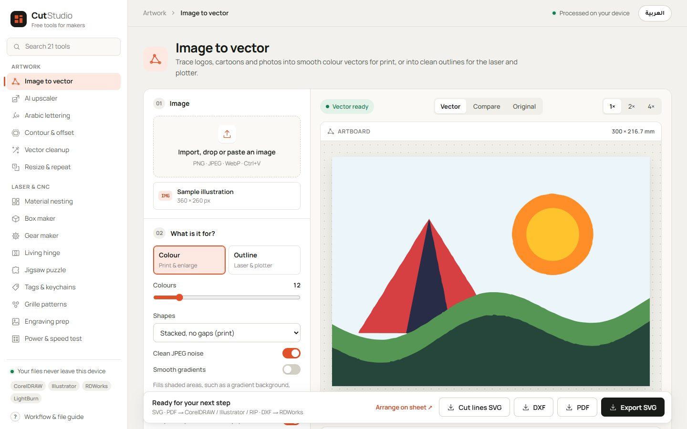
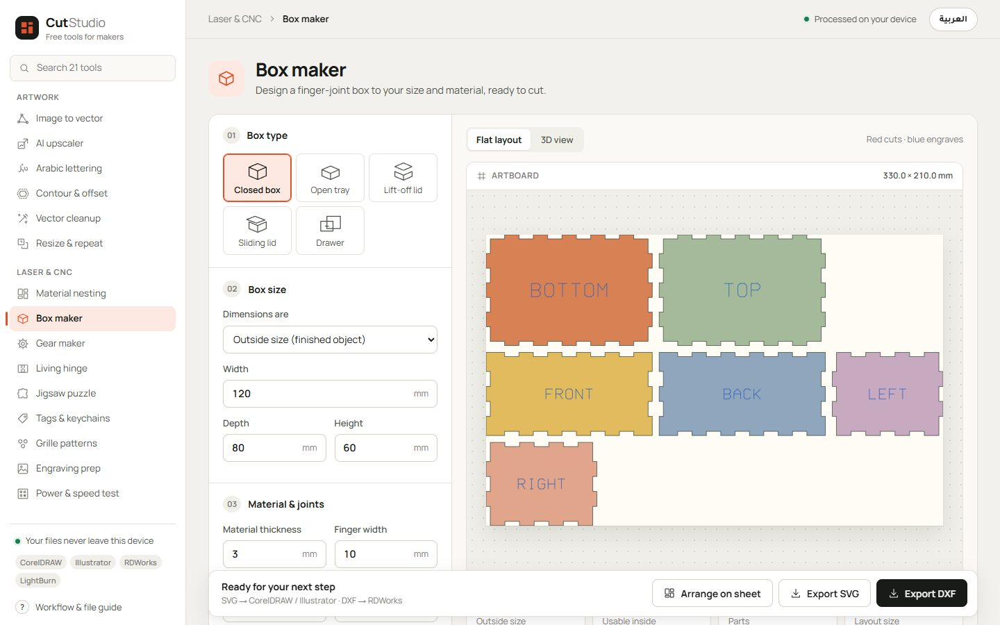
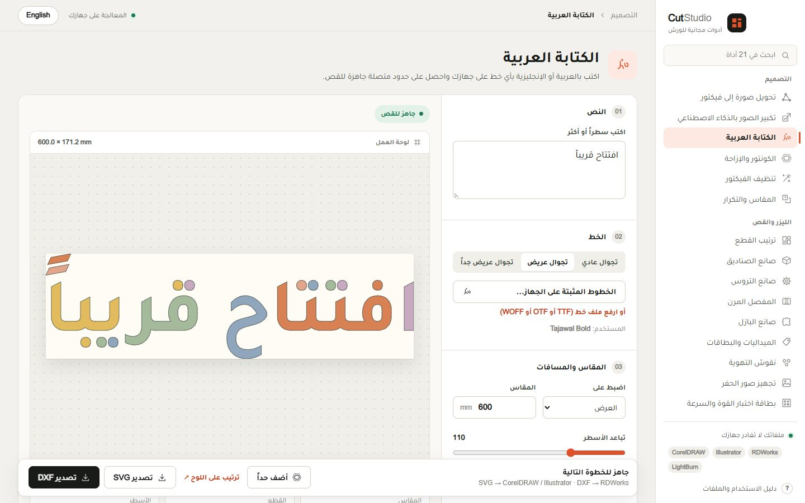
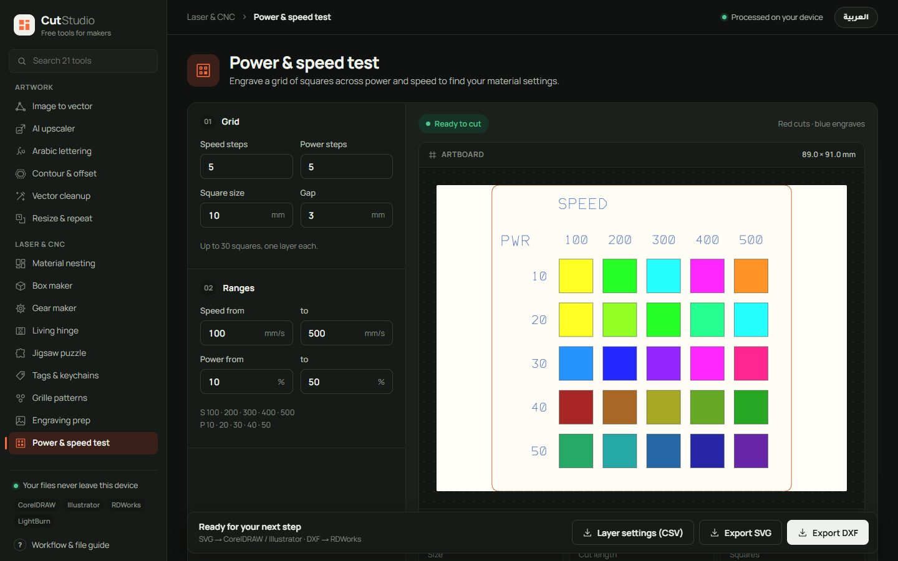
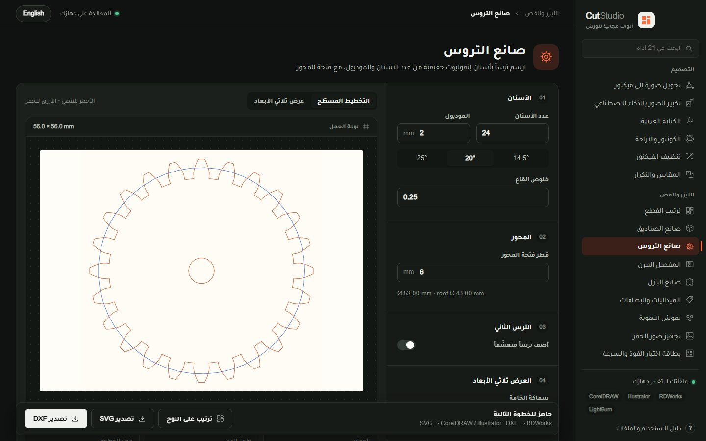

# Cut Studio

**Free design, laser and print tools that run in your browser, in Arabic and English.**
أدوات مجانية للتصميم والليزر والطباعة، تعمل في متصفحك بالعربية والإنجليزية.

**[cutstudio.omardeek.tech](https://cutstudio.omardeek.tech)**



Cut Studio is built in and for a signage and laser workshop in Palestine. Every tool answers a job that comes through the door: a logo to cut in acrylic, an Arabic shop name for the plotter, a 6 m shop-front poster, a box of keychains to quote. The files open cleanly in CorelDRAW, Illustrator, RDWorks and LightBurn, and nothing you open ever leaves your device: there is no account and no upload. The one exception is said plainly where it happens: Design from text sends your description to Recraft, with your own key, when you ask it to draw.

## The tools

**Artwork**
- **Image to vector.** Colour tracing for print (like Illustrator's Image Trace) and clean outlines for the laser and plotter. Circles come out round and straight edges straight. In cut-out mode every border between two colours is traced once, so nothing is cut twice, and the background is dropped. Any traced colour can be left out or swapped for your own, to match a brand's colours before print.
- **Design from text.** Describe a design and Recraft's AI draws it as an SVG, with your own API key, called straight from the browser. Choose what it is for (a piece to laser cut, line art to engrave, a sticker, an icon) and the description is steered to a shape the workshop can use; one click sends it to Image to vector with the matching settings for cut lines and DXF. The key is never sent anywhere but Recraft, and is remembered only if you ask.
- **AI upscaler.** Real-ESRGAN in the browser, with a print planner (how many pixels a 6 m print needs from 5 m away), one-click common jobs, a plain explanation of every setting, a sample picture to try it on, a detail test before the long run, a before/after slider and extra sharpness for signs.
- **Arabic lettering.** The 231 free Arabic fonts of [Harf](https://harf.omardeek.tech), any font on your computer or a font file, shaped by HarfBuzz and welded into clean cut paths. Letters cut as pieces keep their dots on: every dot, hamza and vowel mark is moved onto its letter or bridged to it, so each letter comes off the machine in one piece. Stencils get bridges instead; sign plates, mounting holes and cake toppers too.
- **Contour & offset.** Round-cornered offsets for acrylic letter bases, weeding borders and print-and-cut sticker lines.
- **Vector cleanup.** Repairs any SVG, DXF or CorelDRAW file for cutting: removes overlapping lines (Delete Overlap), joins small gaps and cuts thousands of nodes down to lines and arcs.
- **Resize & repeat.**

**Laser & CNC**
- **Material nesting**, **box maker** (finger joints, lids, sliding lids, drawers, dividers, 3D view), **living hinge**, **grille patterns**, **engraving prep** (eight dithering methods), **power & speed test card** (one colour layer per square, settings as CSV), **fit test**, **CNC prep** and **feeds & speeds**.

**Ready-made**
- **Product templates** (QR stand, phone stand, menu holder, door sign, gift box, desk organizer and more), **polygon box**, **keychains & tags** (Arabic text, any shape), **trophy base**, **gear maker** (involute gears, meshing pairs, turning 3D view), **jigsaw puzzle**, **ruler maker**, and a link to [Shakl](https://shakl.omardeek.tech) for 3D models.

**Print**
- **Poster tiling** into printer-width panels with overlap and eyelet marks, **print sheets** for stickers, labels and sublimation, and a **DPI calculator**.

**Business**
- **Job quote**: material, machine time from the artwork, labour, overhead and profit down to a price per piece, and a quote ready to send by WhatsApp.

## Files that are ready to cut

Exports keep real geometry. SVG keeps lines, arcs and Bézier curves; DXF (R12, read by every cutting program) uses lines and arcs, with curves turned into arcs within 0.01 mm. A generated circle is two arcs, not hundreds of segments; a box keeps its finger joints as exact lines. Tests check that no generator ever writes a duplicated or crossing cut line.

| | |
| --- | --- |
|  |  |
|  |  |

## Running it

```bash
npm install
npm run dev
```

Then open http://127.0.0.1:3000. `npm run build` makes a production build; `npm test` runs the Playwright suite (unit tests of the geometry and full browser tests of every tool).

**CorelDRAW files** are read in the browser by libcdr compiled to WebAssembly (`public/wasm/cdr2xhtml.wasm`). To rebuild it, run `sh native/cdr/build.sh` on Linux or WSL; it fetches pinned, checksum-verified sources.

**A test pack** for your machines: `npm run test-pack` writes a box, a gear, a puzzle, a traced logo and an offset as SVG and DXF into `test-pack/`.

## How it is built

Next.js 16 and React 19, with every tool running in the browser: tracing and nesting in Web Workers, Real-ESRGAN through ONNX Runtime Web (WebGPU when available), text shaping through HarfBuzz and CorelDRAW reading through libcdr, both compiled to WebAssembly, and vector welding and offsets through Clipper2. `docs/TOOLKIT.md` documents each tool's limits and tolerances.

```
src/app/        routes: /[locale]/[tool], sitemap, robots
src/toolkit/    every tool, its geometry and its interface
tests/          geometry and browser tests
```

## Licence

MIT, © 2026 [Omar Aldeek](https://omardeek.tech). Third-party components and their licences are listed in [THIRD_PARTY_NOTICES.md](THIRD_PARTY_NOTICES.md).

---

<div dir="rtl">

## بالعربي

Cut Studio مجموعة أدوات مجانية صنعتها لورشتي للدعاية والإعلان والقص بالليزر في فلسطين، وتركتها مفتوحة للجميع. كل أداة تحل عملاً حقيقياً: شعار للقص على الأكريليك، اسم محل بالعربي للبلوتر، بوستر واجهة بستة أمتار، أو عرض سعر لطلبية ميداليات.

- ملفاتك لا تغادر جهازك، حتى ملفات CorelDRAW: لا حساب ولا رفع ملفات.
- الملفات تخرج جاهزة للقص: خطوط وأقواس ومنحنيات حقيقية، بلا خطوط مكررة تحتاج Delete Overlap.
- الواجهة بالعربية والإنجليزية، والكتابة العربية تتشكل بشكل صحيح بأي خط.

**جرّبها: [cutstudio.omardeek.tech/ar](https://cutstudio.omardeek.tech/ar)**

</div>
